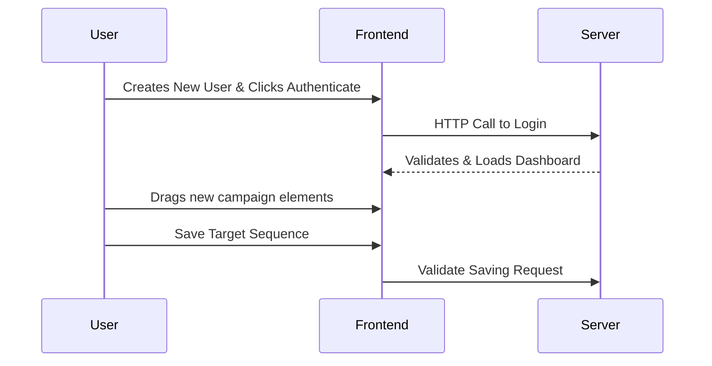

# Functional Testing Plan: Omniverse

## 1. Overview
Functional testing operates dynamically against business requirements simulating exactly what the user observes from the DOM. This ensures user experiences (UX) operate effectively without developer intervention.

## 2. Functional Business Logic Flow (Diagram)

## 3. Tools & Technologies
- **E2E Automation Framework:** Playwright
- **CI/CD Integration:** GitHub Actions

## 4. Scope of Functional Testing

### 4.1. End-To-End User Journeys
User registers, generates an email sequence via Visual Builder, adds CSV lists, and tracks status limits safely.

## 5. Standard Test Execution Matrix

| Test ID | Functional Story | Test Case Description | Pre-conditions | Expected Result | Actual Result | Status |
|---------|------------------|-----------------------|----------------|-----------------|---------------|--------|
| **FT-001** | Login Route UX | Validating core sign-up and login UX flow | Test user details configured | Success toast appears and automatically routes to `/dashboard` | | ⬜ Pass / ⬜ Fail |
| **FT-002** | Campaign Drag Events | Linking node events successfully | Using isolated Dnd-kit nodes | Action A connects to Action B and forms a logical sequence | | ⬜ Pass / ⬜ Fail |
| **FT-003** | Social Rejection Mapping | Entering wrong social password UX | Connected FB app module | Network safely traps error, throws generic localized warning "Bad credentials" | | ⬜ Pass / ⬜ Fail |
| **FT-004** | Limit Threshold UI | Validating locked feature plan limits | Test User set to Free Plan Limit | Creating campaign > max hits "Upgrade Plan" paywall dialog | | ⬜ Pass / ⬜ Fail |
| **FT-005** | Sidebar Navigation | Testing routing and active selections | Desktop browser | Clicking Instagram routes to `/instagram` and active highlight works | | ⬜ Pass / ⬜ Fail |

## 6. Standards and Best Practices
- **Resilience**: Ensure `getByRole` or `data-testid` are heavily utilized instead of hardcoded HTML structure mapping.
- **Reporting Options**: Attach `.png` or Playwright traces on failures natively alongside document.
