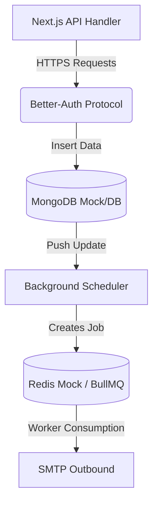

# Integration Testing Plan: Omniverse

## 1. Overview
Integration testing validates the interactions between multiple dependent components in Omniverse. It ensures that communication across process boundaries (such as Next API routing to MongoDB, or BullMQ talking to workers via Redis) executes perfectly.

## 2. Integration Pathways (Diagram)

## 3. Tools & Technologies
- **HTTP / API Testing:** Supertest
- **Database Backend:** MongoDB In-Memory Server
- **Queue/Redis Backend:** Redis Mock or Docker Container

## 4. Scope of Integration Testing

### 4.1. Next.js App Router APIs (`app/api/`)
- Authentication session mapping through MongoDB.
- Validates data payloads saved completely.

### 4.2. Contact List Aggregation & Workers
- Verifying the data chain from CSV upload endpoints dropping formatted contact lists correctly.

## 5. Standard Test Execution Matrix

| Test ID | Pathway | Test Case Description | Pre-conditions | Expected Result | Actual Result | Status |
|---------|---------|-----------------------|----------------|-----------------|---------------|--------|
| **IT-001** | `/api/auth` -> DB | Full authentication session write | Valid `better-auth` config & DB connection | User entry written into DB along with Session | | ⬜ Pass / ⬜ Fail |
| **IT-002** | `/api/system/ips` | Admin route protection | Access standard JWT user token | Reject requests to Admin routes showing `401/403 Error` | | ⬜ Pass / ⬜ Fail |
| **IT-003** | Scheduler -> BullMQ | Job correctly transitioning to Queue | Setup fake Campaign `status: active` | Worker receives job from Redis queue payload correctly | | ⬜ Pass / ⬜ Fail |
| **IT-004** | /api/campaigns -> DB | Campaign builder configuration save | Payload matching drag-n-drop JSON | MongoDB writes valid Object sequence to campaign instance | | ⬜ Pass / ⬜ Fail |
| **IT-005** | System Recon -> DB | Updating profile health to "Restricted" | Simulate account constraint returned | System status flips DB constraint automatically | | ⬜ Pass / ⬜ Fail |

## 6. Standards and Best Practices
- **Database Teardown**: Each test must clean the memory server instances up immediately.
- **Pipeline Integrity**: Validate not just that functions return true, but the output exactly matches data models needed for the upcoming layer sequence.
