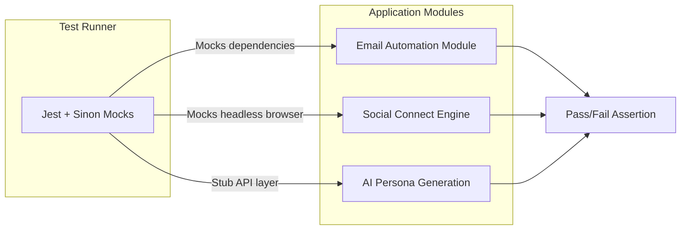

# Module Testing Plan: Omniverse

## 1. Overview
Module testing validates distinct segments or "Domains" of the Omniverse architecture. Unlike unit testing, module testing evaluates the collaboration of several internal elements but stops short of full database/system integrations. It ensures that encapsulated modules function correctly independently of the whole application.

## 2. Module Execution Flow (Diagram)

## 3. Tools & Technologies
- **Testing Framework:** Jest
- **Stubbing/Mocking:** Sinon.js or Jest Mocks 

## 4. Scope of Module Testing

### 4.1. Email Automation Module
- **Target:** `lib/queue/worker-process.js` and `lib/queue/scheduler.js`
- Verify that the module manages ramp-up speeds exactly based on simulated data.

### 4.2. Social Automation Engine Modules
- **Targets:** `lib/social-automation/*-engine.js` files.
- Validate daily boundaries (stopping at N connections per profile).

## 5. Standard Test Execution Matrix

| Test ID | Module Target | Test Case Description | Pre-conditions | Expected Result | Actual Result | Status |
|---------|---------------|-----------------------|----------------|-----------------|---------------|--------|
| **MT-001** | `Email Worker` | Message personalization tagging | Contact properties mock & Subject Body mock | `$$f_name$$` correctly swapped to contact's real name | | ⬜ Pass / ⬜ Fail |
| **MT-002** | `Email Scheduler` | Timezone scheduling | Scheduler triggered, campaign in different TZ | Scheduler ignores campaigns outside the 9-5 window | | ⬜ Pass / ⬜ Fail |
| **MT-003** | `LinkedIn Engine` | Limit threshold constraint | Engine simulates loops; Limit set to 20 | Stops triggering action on 20th iteration | | ⬜ Pass / ⬜ Fail |
| **MT-004** | `AI Persona Module` | Core formatting validation | Standard prompt schema + Tone criteria | AI Prompt strictly appends the configured Persona schema | | ⬜ Pass / ⬜ Fail |
| **MT-005** | `Instagram Engine` | Ignore missing elements | Mocks failure finding IG login field element | Module suppresses crash and exits cleanly without throwing | | ⬜ Pass / ⬜ Fail |

## 6. Standards and Best Practices
- **Dependency Isolation:** Modules must not interact directly with external modules. External data (e.g., DB results) should be provided as statically generated fixture files.
- **Mutilation Prevention**: No active writes to ANY collection logic via Mocked database engines.
