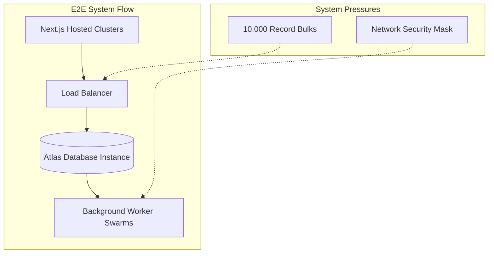

# System Testing Plan: Omniverse

## 1. Overview
System testing encompasses the evaluation of the Omniverse application as an entire product, including Stealth browser detection, background queuing limits, encryption standards, and failover states dynamically. 

## 2. System Level Operation (Diagram)

## 3. Tools & Technologies
- **Load / Stress Testing:** k6 / Artillery
- **Hardware/Server Monitoring:** PM2 Metrics
- **Stealth Assessment:** BotSight / CreepJS payloads

## 4. Scope of System Testing

### 4.1. Stealth Assessment
Evaluate exactly whether Playwright with `puppeteer-extra-plugin-stealth` survives modern protection architectures required locally.

### 4.2. Volume & Stress Operations
Flood BullMQ instances testing if memory leaks occur during 48+ hour cycles. 

## 5. Standard Test Execution Matrix

| Test ID | Testing Category | Test Case Description | Pre-conditions | Expected Result | Actual Result | Status |
|---------|------------------|-----------------------|----------------|-----------------|---------------|--------|
| **ST-001** | Load Balancing | Peak load test to API routes | k6 instance loaded w/ 100 VUs | Response times <500ms; zero dropped connections | | ⬜ Pass / ⬜ Fail |
| **ST-002** | Stealth Evaluation | Verify Proxy leak evasion | Headless worker triggers CreepJS | Tracker flags browser as `True/Real User` with no leaks | | ⬜ Pass / ⬜ Fail |
| **ST-003** | Data Security | Validate AES-256-GCM cipher efficacy | Read DB entries directly | Plain text SMTP/Social passwords cannot be read directly | | ⬜ Pass / ⬜ Fail |
| **ST-004** | Master Failover | Kill-Switch / Process failure cycle | Trigger `kill-switch` on dashboard | All Node.js workers halt jobs gracefully and enter sleep cycles | | ⬜ Pass / ⬜ Fail |
| **ST-005** | Memory Integrity | Background job memory consumption | Submit 100k Redis emails | Memory max consumption levels off under 2GB, no crashes recorded | | ⬜ Pass / ⬜ Fail |

## 6. Standards and Best Practices
- **Production Specs Only**: Use exactly mirroring production spec servers for this phase.
- **Tracing Capabilities**: Attach external Datadog or ELK stack for diagnostic metric review post-test.
