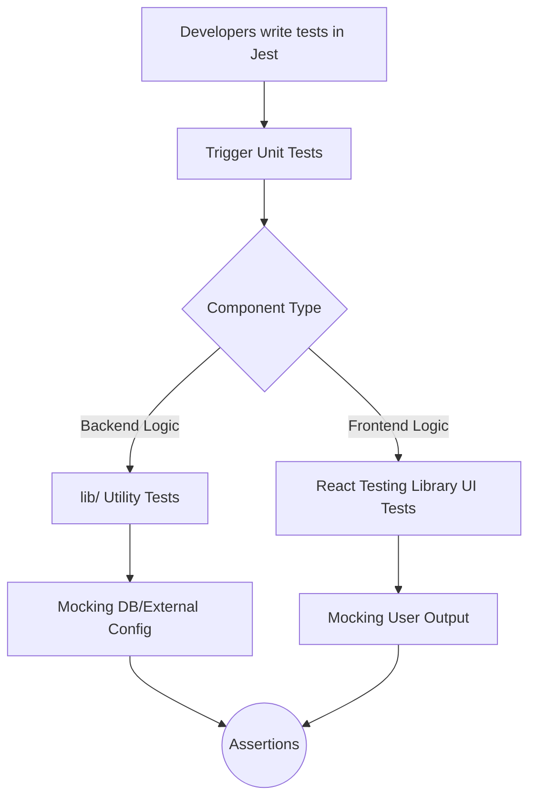

# Unit Testing Plan: Omniverse

## 1. Overview
Unit testing focuses on verifying the smallest testable parts of the Omniverse application in isolation. This includes individual functions, utilities, and UI components. The goal is to ensure that each unit performs as expected before integrating it with other parts of the system.

## 2. Testing Execution Flow (Diagram)

## 3. Tools & Technologies
- **Testing Framework:** Jest
- **Frontend Components:** React Testing Library
- **Mocking:** Jest's built-in mocking capabilities (for databases, Redis, etc.)

## 4. Scope of Unit Testing

### 4.1. Utility Functions (`lib/`)
These are pure functions and isolated utilities that form the core logic of the application.
- **Encryption (`lib/encryption.js`)**: 
  - Test `encrypt()` and `decrypt()` with matching keys.
  - Assert that attempting to decrypt with wrong keys or corrupted data fails correctly.
- **Limits & Plans (`lib/limits.js`)**: 
  - Test `checkPlanLimit()` with different user roles.
- **Timezones (`lib/timezones.js`)**: 
  - Ensure time conversions correctly handle Daylight Saving Time.

### 4.2. Frontend UI Components (`app/components/`)
Focus on component rendering, state changes, and user interactions without network requests.

## 5. Standard Test Execution Matrix 
All execution passes will be documented in this matrix natively or within a Jira/QA tracking software using these requirements.

| Test ID | Target Component | Test Case Description | Pre-conditions | Expected Result | Actual Result | Status |
|---------|------------------|-----------------------|----------------|-----------------|---------------|--------|
| **UT-001** | `encryption.js` | Test valid encryption string generation | Standard AUTH_SECRET provided | String returned in `iv:authTag:data` format | | ⬜ Pass / ⬜ Fail |
| **UT-002** | `encryption.js` | Attempt decryption with tampered payload | Valid encrypted string with modified authTag | Decryption throws a secure payload error | | ⬜ Pass / ⬜ Fail |
| **UT-003** | `limits.js` | Admin bypass logic check | User role set to `admin` | Returns `{ allowed: true }` bypassing max limits | | ⬜ Pass / ⬜ Fail |
| **UT-004** | `proxy-allocator.js` | Assign proxy to fresh account | DB mock returns array of proxies | Platform usage correctly increments | | ⬜ Pass / ⬜ Fail |
| **UT-005** | `Sidebar.jsx` | Renders admin tab securely | Session mock sets role to `user` | Admin panel links are NOT rendered to DOM | | ⬜ Pass / ⬜ Fail |

## 6. Standards and Best Practices
- **AAA Pattern**: All tests must follow the Arrange, Act, Assert pattern.
- **Testing Naming Requirements**: Use `[Component/File].spec.js` mapping precisely to the target.
- **Coverage coverage**: Maintain a minimum of 80% line coverage for critical business logic (`lib/` utilities).
